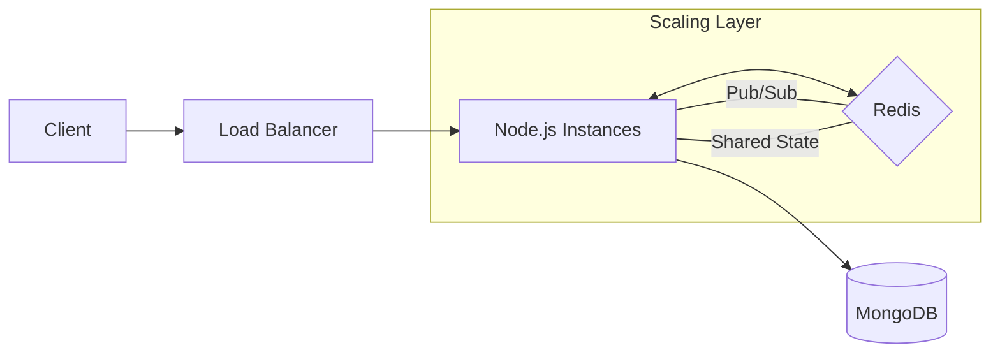

# Anon Chat — Backend ⚡

The Node.js engine powering the Anon Chat application. This service manages user authentication via REST API and handles real-time user matching and messaging through a secure WebSocket server.

---

## 🚀 Tech Stack

- **Runtime:** Node.js (v18+)
- **Framework:** Express 5
- **Database:** MongoDB with Mongoose ODM
- **Real-time:** Native `ws` module
- **Authentication:** JWT (JSON Web Tokens) with Refresh Token support

## 🛠️ Setup & Installation

### Prerequisites

- Node.js installed on your machine.
- A running MongoDB instance (Local or [Atlas](https://www.mongodb.com/cloud/atlas)).

### Quick Start

1. **Install Dependencies:**

   ```bash
   npm install
   ```

2. **Environment Configuration:**

   ```bash
   cp .env.sample .env
   ```

   *Edit `.env` and provide your specific configuration values.*

3. **Run the Server:**
   - **Development:** `npm run dev` (uses nodemon)
   - **Production:** `npm start`

---

## 🔐 Environment Variables

| Variable | Description | Default |
| :--- | :--- | :--- |
| `PORT` | Port number for the server | `3000` |
| `JET_SECRET` | Secret key for Access Tokens | - |
| `JET_REFRESH_TOKEN_SECRET` | Secret key for Refresh Tokens | - |
| `MONGODB_URI` | Connection string for MongoDB | - |

---

## 🌐 API Reference

### Authentication (`/api/auth`)

| Method | Endpoint | Description |
| :--- | :--- | :--- |
| `POST` | `/register` | Create a new user account |
| `POST` | `/login` | Authenticate and receive tokens |
| `POST` | `/refresh-token` | Obtain a new access token using a refresh token |

---

## 🔌 WebSocket Implementation

The server uses a single port for both HTTP and WebSocket traffic.

### 🛡️ Authentication Flow

The WebSocket connection is **secured**. Upon connection, the server expects a JWT token:

1. **Header-based:** `Authorization: Bearer <token>` (Recommended for native clients).
2. **Query-based:** `ws://host:port?token=<token>` (Used for web/browser clients).

*Connections without a valid token are immediately closed with code `1008`.*

### 📤 Client-to-Server Events

Sent as JSON with `event` and `data` fields.

| Event | Data Payload | Description |
| :--- | :--- | :--- |
| `enter-waiting-room` | - | Join the global matching queue. |
| `send-message` | `{ "chatId": "...", "message": "..." }` | Send a message to your matched partner. |
| `typing` | `{ "chatId": "...", "isTyping": true }` | Notify your partner that you are typing. |
| `toggle-reaction` | `{ "chatId": "...", "messageId": "...", "emoji": "..." }` | Add or remove an emoji reaction to a message. |

### 📥 Server-to-Client Events

| Event | Payload | Description |
| :--- | :--- | :--- |
| `in-waiting-room` | - | Confirmed entry into the queue. |
| `in-chat` | `{ "chatId": "...", "partner": { "id": "...", "username": "...", "profilePicture": "..." } }` | Success matching with a partner. |
| `send-message` | `{ "chatId": "...", "messageId": "...", "senderId": "...", "message": "...", "timestamp": "...", "reactions": [] }` | Sent back to the sender as confirmation. |
| `message-received` | `{ "chatId": "...", "messageId": "...", "senderId": "...", "message": "...", "timestamp": "...", "reactions": [] }` | New message from your partner. |
| `typing` | `{ "chatId": "...", "isTyping": true }` | Notification that your partner is typing. |
| `message-reaction-updated` | `{ "chatId": "...", "messageId": "...", "emoji": "...", "userId": "...", "action": "added/removed", "reactions": [...] }` | Broadcast when a reaction is updated. |
| `partner-left` | - | Notification that the partner has disconnected. |
| `error` | `{ "message": "..." }` | Generic error reporting. |

---

## 📂 Project Architecture

The backend follows a modular directory structure for better maintainability:

- `src/config/`: App-wide configurations (DB, Socket types).
- `src/controllers/`: Request handling logic.
- `src/helper/`: Utility functions (Token generation, Response formatting).
- `src/model/`: Mongoose schemas and data models.
- `src/repository/`: Data access layer (DB operations).
- `src/routes/`: REST API route definitions.
- `src/services/`: Core business logic.
- `src/socket/`: WebSocket server, routers, and event handlers.
- `src/validator/`: Input and socket message validation.

---

## 🏗️ Architecture & Scaling Strategy

This project is built with **modern backend engineering principles**, making it ready for horizontal scaling with minimal refactoring.

### 🌐 System Architecture

The application is designed to be **stateless** wherever possible, allowing multiple instances to run behind a Load Balancer.



### 🚀 Scalability Roadmap

- **Horizontal Scaling**: By introducing **Redis Pub/Sub**, message events can be broadcasted across different server nodes, ensuring that a user on *Instance A* can chat seamlessly with a user on *Instance B*.
- **Distributed State**: The current in-memory `WaitingQueue` can be migrated to **Redis Sets or Lists**. This ensures a global matching queue that remains consistent across all vertical and horizontal scaling operations.
- **Message Persistence**: While currently ephemeral, integrating a **Message Persistence Layer** in MongoDB would enable chat history and session recovery, transforming the demo into a production-ready product.
- **Microservices Ready**: The decoupled nature of the Auth (REST) and Chat (Socket) layers allows for independent scaling of these components as separate services.

---

## 📜 Scripts

- `npm start`: Standard production start.
- `npm run dev`: Development mode with hot-reloading.
- `npm test`: Run the test suite (currently a placeholder).
