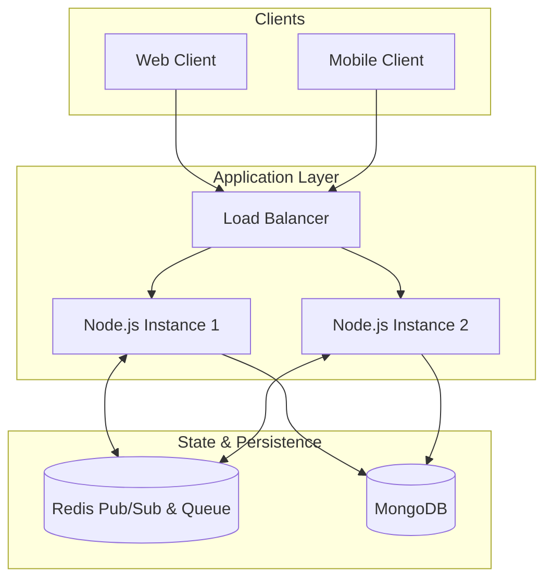

# Anon Chat 🚀

[](Backend/)
[](Frontend/)
<!-- [](https://opensource.org/licenses/ISC) -->

A premium, real-time anonymous chat application that pairs users in instant one-on-one conversations. Experience seamless communication with a focus on simplicity and privacy.

---

## ✨ Features

- **🔐 Secure Authentication** — Robust registration and login system utilizing JWT with Access and Refresh tokens for a secure session.
- **🕒 Intelligent Waiting Room** — An automated queue system that matches you with another active user for a private chat.
- **⚡ Real-time Messaging** — Instant, low-latency communication powered by WebSockets.
- **🎭 Complete Anonymity** — Connect with strangers safely. Your identity is protected, and you're only identified by your chosen username.
- **🔄 Session Management** — Stay informed with real-time notifications when a partner leaves, and easily re-join the matching pool.
- **📱 Cross-Platform** — Beautifully crafted Flutter frontend for and Web with a dark-themed premium UI.

## 🛠️ Tech Stack

| Layer | Technology | Key Libraries |
| :--- | :--- | :--- |
| **Frontend** | Flutter | Provider, Dio, web_socket_channel |
| **Backend** | Node.js (Express) | Mongoose, Socket.io (ws implementation) |
| **Real-time** | WebSocket (ws) | Native `ws` module for performance |
| **Database** | MongoDB | Mongoose ODM |
| **Security** | JWT | `jsonwebtoken` for stateless auth |

## 📂 Project Structure

```text
Anon Chat/
├── Backend/                 # Node.js API + WebSocket server
│   ├── src/
│   │   ├── config/          # Database & Socket event configurations
│   │   ├── controllers/     # Authentication & User logic
│   │   ├── model/           # Data schemas (User, ChatRoom, Queue)
│   │   ├── socket/          # WebSocket routing & event handlers
│   │   └── ...
│   └── README.md            # Detailed Backend Documentation
├── Frontend/
│   └── anon_chat_frontend/  # Flutter Application
│       ├── lib/
│       │   ├── core/        # Theme, Constants, API Endpoints
│       │   ├── providers/   # State Management (Auth & Chat)
│       │   ├── screens/     # Premium UI Screens
│       │   ├── services/    # WebSocket & REST API Clients
│       │   └── ...
│       └── README.md        # Detailed Frontend Documentation
└── README.md                # Project Overview (This file)
```

## 🚀 Getting Started

### Prerequisites

- **Node.js** (v18+) & **npm**
- **MongoDB** (Local or Atlas)
- **Flutter SDK** (Stable channel)

### 1. Backend Setup

```bash
cd Backend
npm install
cp .env.sample .env
# Update .env with your Port, Secrets, and MONGODB_URI
npm run dev
```

*The server will run at `http://localhost:3000`. Detailed API docs are in the [Backend README](Backend/README.md).*

### 2. Frontend Setup

```bash
cd Frontend/anon_chat_frontend
flutter pub get
flutter run
```

*Ensure you configure the `baseUrl` in `lib/core/constants/api_constants.dart` to match your backend address.*

## 🏗️ Architecture & Scaling

While this version is optimized for a single-instance demo, the architecture is designed with **horizontal scalability** in mind.

### System Architecture



### Scaling Strategy (Future-Proofing)

To handle thousands of concurrent users, the following enhancements can be implemented:

- **Redis Pub/Sub**: Synchronize messages across multiple Node.js instances.
- **Shared State**: Move the `WaitingQueue` and active `ChatRooms` from in-memory to Redis for cross-server consistency.
- **Message Persistence**: Store chat history in MongoDB for session recovery and long-term storage.
- **Global Load Balancing**: Distribute traffic across different geographical regions.

## 📄 License

This project is licensed under the **ISC License**.
